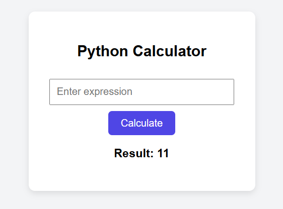

# 🧮 Python Web Calculator

A simple web-based calculator built with **Python Flask** and a clean, modern GUI using **HTML**, **CSS**, and **JavaScript**.

---

## 📌 Features

- User-friendly web interface
- Evaluate any valid Python expression (e.g. `2+3*5`, `10/2`)
- Error handling for invalid inputs
- Fully customizable front-end design

---

## 📁 Folder Structure

## Project UI
